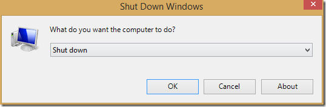

# Remote Desktop Shutdown

Shows a shutdown window to sign out, shutdown or restart windows.

If you are connected to a windows machine via a Remote Desktop Connection, the options to shutdown or restart the computer aren’t available in the start menu. Therefore you can use this small application to shutdown the machine.